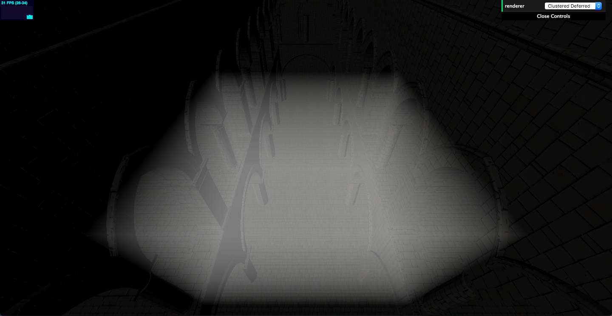

# Heatstroke
A WebGL 2.0 based Volumetric Renderer based on [Frostbite's Physically Based Volumetric Renderer](https://www.ea.com/frostbite/news/physically-based-unified-volumetric-rendering-in-frostbite).

# Development Blog

## 11/20 - Milestone 1

For this milestone we simply generated a texture to ray march through. At each point we first cheked to see if we're in the volume. If we are then we solve the lighting equation with participating media. 

### Progression 

#### *Original Sponza Scene*

#### *Texture Creation*

#### *Ray Marched Scene*

#### *Ray Marched Cube*

# References
- [Physically-based & Unified Volumetric Rendering](https://www.ea.com/frostbite/news/physically-based-unified-volumetric-rendering-in-frostbite)
- [Volumetric Fog: Unified Compute Shader Based Solution to Atmospheric Scattering](https://bartwronski.files.wordpress.com/2014/08/bwronski_volumetric_fog_siggraph2014.pdf)
- [Fast, Flexible, Physically-Based Volumetric Scattering](https://developer.nvidia.com/sites/default/files/akamai/gameworks/downloads/papers/NVVL/Fast_Flexible_Physically-Based_Volumetric_Light_Scattering.pdf)

