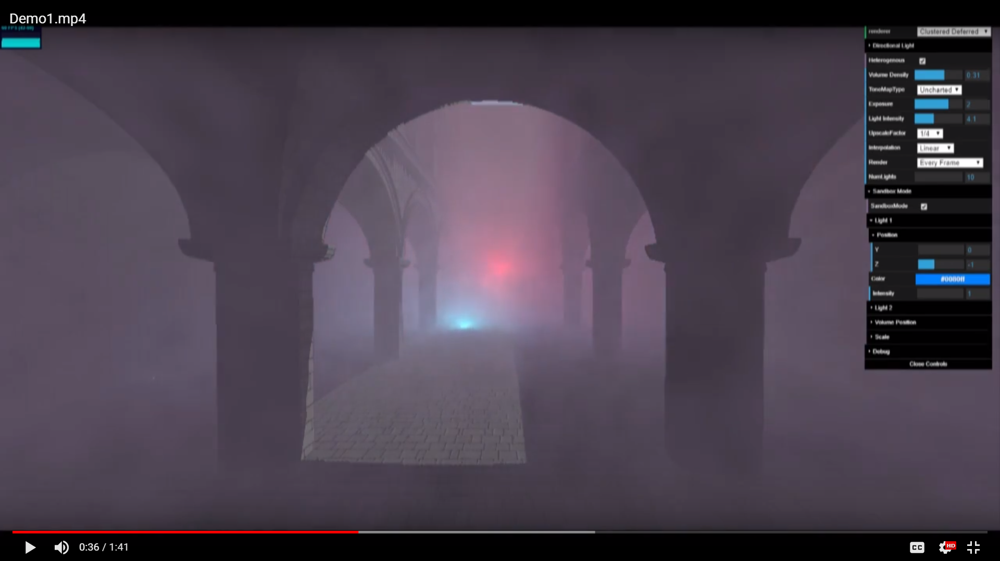
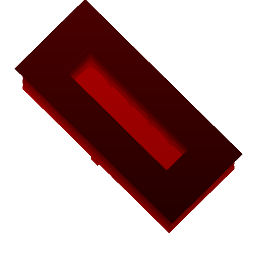
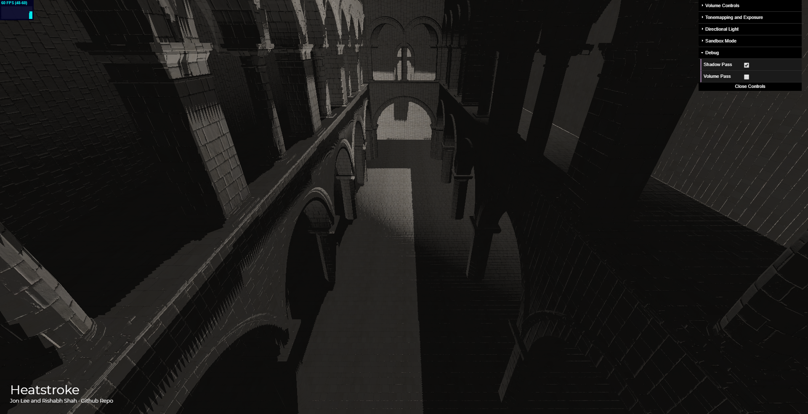
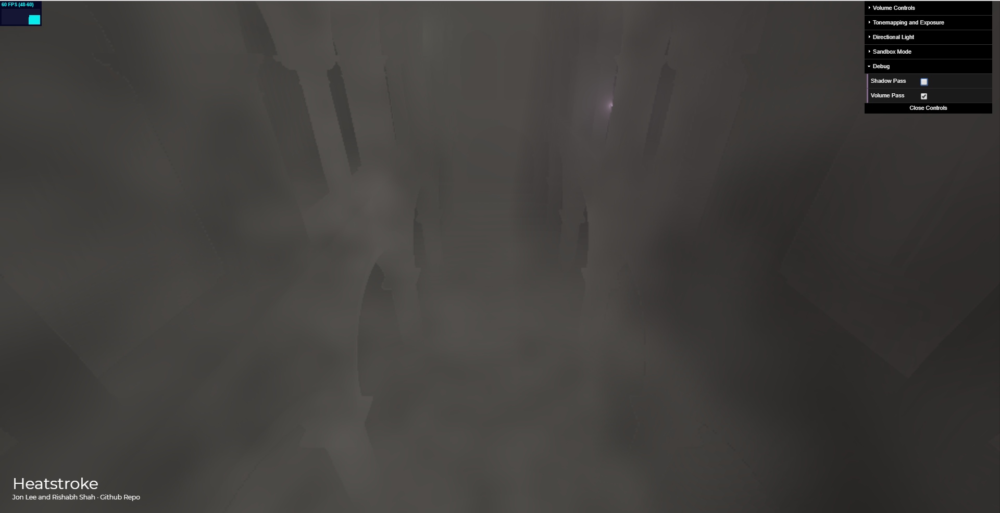
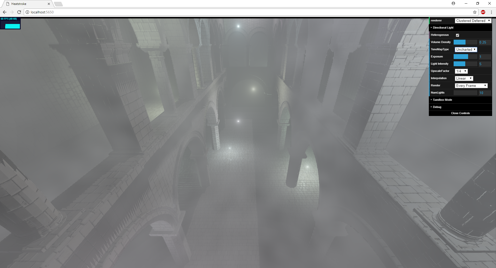
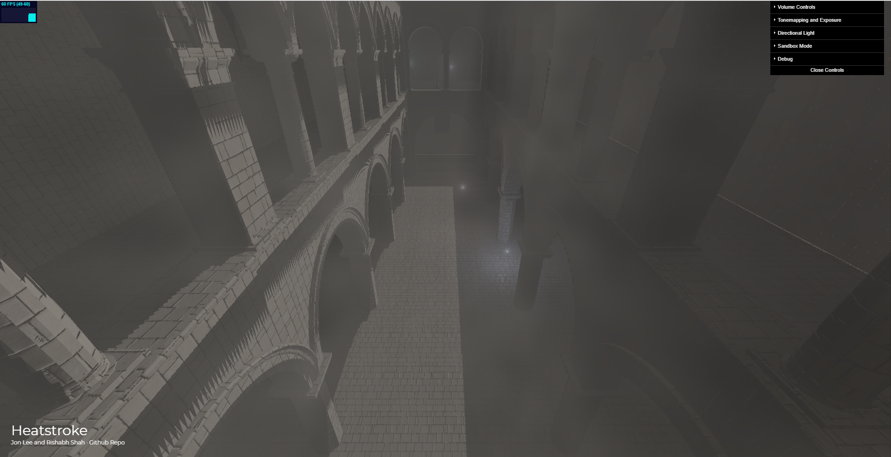
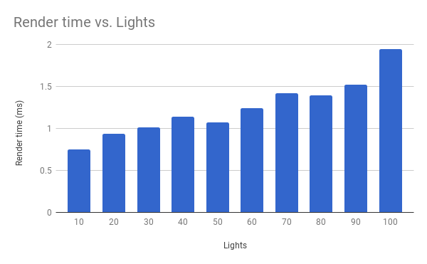

# Heatstroke
A WebGL 2.0 Volumetric Renderer inspired by [Frostbite's Physically Based Volumetric Renderer](https://www.ea.com/frostbite/news/physically-based-unified-volumetric-rendering-in-frostbite).

__Team: Rishabh Shah and Jonathan Lee__

Jump to [live demo!]()

## Project Overview
Volumetric rendering is a very desirable feature in renderers. Analytical techniques have been used since a long time to have volumetric effects in games and real-time engines. With the increase of GPU computation power, modern game engines are moving towards more physically-based approaches to volumetric rendering. But, we are yet to see good web based volumetric renderers, which was the inspiration behind the project.

We found Frostbite’s approach to be particularly interesting, so a lot of our engine is based on that. WebGL 2.0 features like 3D textures, filtering and mip-mapping, and multiple render targets helped a lot. We had to make a few compromises due to the lack of a compute pipeline, but _all is well that ends well_.

## GUI and Controls
- Volume Controls:
	- Heterogeneous: turning off makes the volume homogeneous
	- Volume Density
	- Upscale Factor: renders smaller volume than screen size for performance. More on this later.
	- Interpolation: interpolation method used to draw the up-sampled volume. Linear is generally better than nearest neighbour.
	- Render: every frame or every two frames to increase the performance. The boost is not as significant as we expected.
- Tonemapping, Exposure, Lights:
	- ToneMapType: uncharted 2, Reinhard, Linear. Uncharted 2 gives best results, even when there are too many lights with high intensity values.
	- Exposure: can tweak the exposure if the scene is over/underexposed
	- Light intensity: multiplier for intensity of lights. [Sandbox mode has its seperate controls]
	- Directional light: change the x/z position and color of Sun
- Sandbox Mode:
	- Light 1 and Light 2: can tweak position and colors of the point lights
	- Volume Position and Volume Scale
- Debug:
	- Visualize the shadow map and volume rendering

## Building and Running Locally
1. Clone the repo, and run `npm install` on the root directory.
2. Run `npm start` on the root directory to start the server.
3. Go to the `localhost` in a WebGL 2.0 supporting browser.

## Technical Overview
For our implementation, we used __ray marching__ for volume integration and rendering. Ray marching in its simplest form is easy. We first generate a ray from the camera towards the pixel, and move forward in the scene at small steps, until we hit geometry. At every step on this path, we compute the light contribution for the volume. This gets complicated however with heterogeneous volumes, multiple lights, large scenes, shadow maps, and performance requirements. Ray marching is a performance intensive process as there are a lot of computations per pixel to get a decent image. In some cases, it can go over 100 times the render times of non-volumetric renders of the same scenes.

Game engines use some clever performance tricks to get the most out of the computing power available. The first thing that we did was to create a __Clustered Deferred Shading__ pipeline for our renderer. _We worked on this before, with WebGL 1.0, so we just had to port it to WebGL 2.0._

#### Light Clustering
The idea here, is to divide the scene in a grid(clusters), and assign lights to the clusters. When shading the geometry, or volume, we can look-up what light is in the cluster of the point to be shaded, and compute lighting for only those lights and not the ones that are far away.

#### Deferred Shading
When we have multiple passes of rendering, we don't always need to render every fragment. Using a deferred pipeline, one can convert the passes from per-fragment computation to per-pixel computation. In the first pass, we store the information of visible fragments for every pixel, and in the following passes, we use that information to directly shade the pixel, giving a huge performance boost.

#### Shadow Mapping
Shadow Mapping is the first pass of our renderer. Here, we essentially render the scene into a texture from the light's perspective. Then, while rendering the image from the camera, the fragment is matched to a pixel in the shadow map to see if it is in shadow.

We have only one light (Sun) shadow mapped. It is typical for real-time engines to not shadow map all the lights in the scene.

| Shadow Map   |  Shadow Render |
|---|---|
|  |    |

#### Volume Rendering
Next pass in our pipeline is volume rendering. Our volumes are represented as 3D density textures (something like frostbite). This makes the volumes authorable by artists. Our density texture is random noise. The texture is low resolution (64 x 64 x 64), which gets up-sampled and smoothed out using WebGL 2.0's native tri-linear interpolation, which is very very fast.

A __single-lobe Henyey-Greenstein phase function__ is used to compute the light bouncing. The volumes are internally represented using the following properties:
- Absorption: light absorbed by the media over distance
- Scattering: light scattered over distance
- Emissive: emitted light

A ray is marched through the volume and rendered to a texture. We store the scattering as rgb components of the texture and transmittance as the w component.

 

##### Volume Upsampling
One of the optimizations we can do, because of the deferred pipeline, is rendering smaller volume textures and up-sampling them for final rendering. This leads to some artefacts depending on how much you downscale the volume pass.

The GUI has an option for interpolation method. Linear interpolation is generally better than nearest neighbour.

[interpolation methods visual comparison](!)

#### Render HDR texture
Once we have our volume, we can now render the final image shading the geometry, and adding the volume contribution for every pixel, from the up-sampled texture. Note that the shadow computation in this shader is only for the opaque geometry behind the volume. The shadow map contribution for the volume itself is computed in the volume pass.

The color at any point is `(albedo + scattering) * transmittance`.

As we have a lot of lights in the scene, which are really bright sometimes, areas of the scene blow out easily in the presence of the volume. Which is why we decided to implement tone-mapping. The result of this pass is rendered to a high-precision 32bit-float RGBA render target.

#### Tone Mapping
The 32bit-float values are toned down in this pass to something our screens can render. We have an option of linear, Reinhard, and [Uncharted 2]() tone mapping. Uncharted 2 tone mapping give really good results consistently.

| Linear/Default | Reinhard | Uncharted |
|--------|----------|-----------|
| |  |  |

#### Pipeline

| Shadow Pass   | G-Buffer | Volume Pass |
|---|--|---|
| |  |   |

| "Final" Shading  | Post Process/Tone Mapping |
|---|---|
| |   |

## Performance Analysis

### Render Passes Performance Comparison

_10 lights, 1/4 volume texture scale, rendering every frame_

|Pass |	Render time (ms)|
|---|---|
|shadow map|	0.03205|
|g-buffer pass|	0.0117|
|volume pass|	0.27165|
|final shader (HDR)|	0.02725|
|tone map|	0.01955|
|total|	0.7909|
|frame skip|	0.769|

### Performance for number of lights

_1/4 volume texture scale, rendering every frame_

|Lights| total time (ms)|
|---|---|
|10|	0.7484|
|20|	0.9359|
|30|	1.0129|
|40|	1.141|
|50|	1.07119|
|60|	1.2425|
|70|	1.4228|
|80|	1.3936|
|90|	1.5246|
|100|	1.94275|

### Laptop vs. Desktop Performance comparison

_30 lights, 1/4 volume texture scale, rendering every frame_

|Volume Downscale |16|	4|	1|
|---|---|---|---|
|Laptop (ms)|	2.1847|	2.304	|2.47824|
|Desktop (ms)|	0.7323|	0.7909|	0.8165|

## Future Work
- Temporal Integration and Anti-Aliasing
- OBJ/GLTF Loading for volumes and scene
- Volumetric Shadow Mapping + Point Light Shadows
- Saving 3D textures and intermediate step for volumetric integration (WebGL doesn't allow this)

## Team Performance

- Primary goals:
    - prim1

- Secondary goals:
    - sec1

- Yet to implement secondary goals:
    - ter1

## Project Timeline
- 11/20:
- 11/27:
- 12/04:
- 12/11:

# References
- [Physically-based & Unified Volumetric Rendering ](https://www.ea.com/frostbite/news/physically-based-unified-volumetric-rendering-in-frostbite)
- [Volumetric Fog: Unified Compute Shader Based Solution to Atmospheric Scattering ](https://bartwronski.files.wordpress.com/2014/08/bwronski_volumetric_fog_siggraph2014.pdf)
- [Fast, Flexible, Physically-Based Volumetric Scattering ](https://developer.nvidia.com/sites/default/files/akamai/gameworks/downloads/papers/NVVL/Fast_Flexible_Physically-Based_Volumetric_Light_Scattering.pdf)
- [Improved Scattering](https://www.shadertoy.com/view/XlBSRz)
- [Shadow Mapping](http://www.chinedufn.com/webgl-shadow-mapping-tutorial/)
- [Uncharted 2 Tonemapping](http://filmicworlds.com/blog/filmic-tonemapping-operators/)
